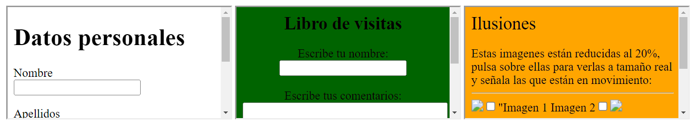

/Segundo%20trimestre/Ejercicios_Hoja_3/Ejercicio_04/ejercicio_04XHTML.xhtml  )

## Se requiere actualizar las primeras dos prácticas, sustituyendo las obsoletas etiquetas BGSOUND y EMBED por la más versátil pero compleja etiqueta OBJECT.

Esta transformación implica la integración de elementos multimedia como videos o audios en las páginas web. 

Documente los inconvenientes encontrados durante el proceso, como la necesidad de complementos adicionales o incompatibilidades entre navegadores.

Realice una comparación detallada entre las etiquetas antiguas y la nueva, destacando sus semejanzas y diferencias.
