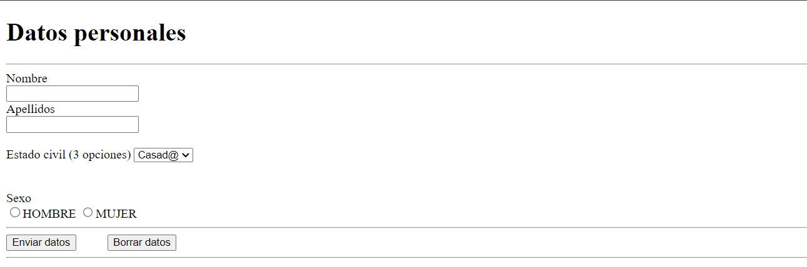
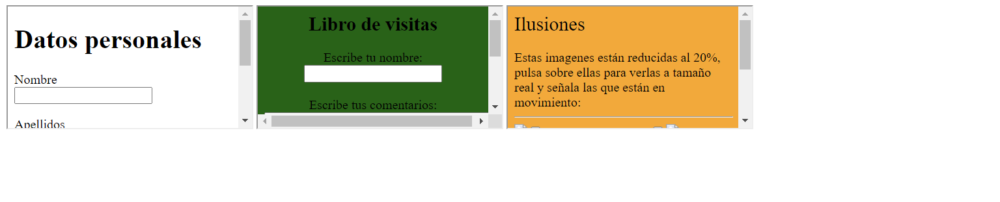
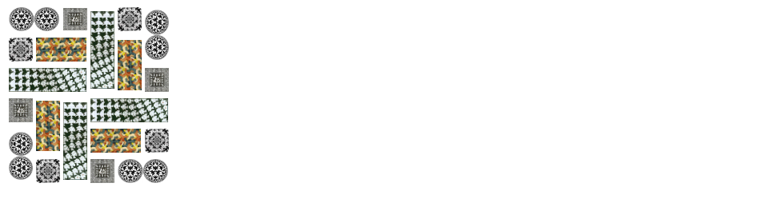

Adapte los ejercicios primero, cuarto y octavo de la segunda hoja de actividades de HTML para que cumplan con las especificaciones del estándar XHTML.

Evalúe la renderización de los documentos resultantes en los navegadores Internet Explorer, Mozilla Firefox y aquellos seleccionados previamente.

Analice las diferencias en la representación y las posibles dificultades encontradas durante el proceso de adaptación.

[Link de la documentación / análisis](Documentacion_Ejercicio6/Documentacion_Ejercicio6.pdf)

/Segundo%20trimestre/Ejercicios_Hoja_3/Ejercicio_06/ejercicio_01XHTML.xhtml  )

/Segundo%20trimestre/Ejercicios_Hoja_3/Ejercicio_06/ejercicio_04XHTML.xhtml  )

/Segundo%20trimestre/Ejercicios_Hoja_3/Ejercicio_06/ejercicio_08XHTML.xhtml  )
