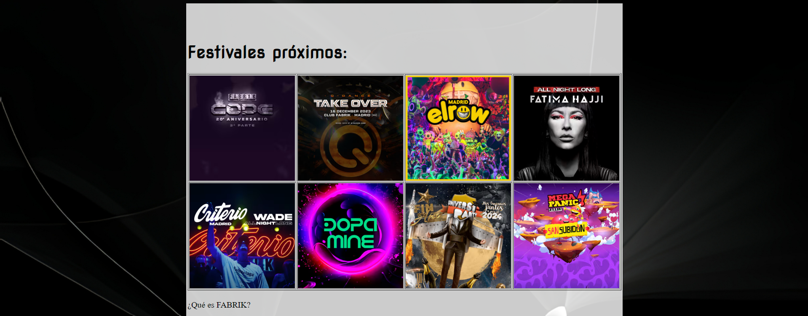

# Haz click en las fotos para acceder a las webs!

## Ejercicio 3.1

/Segundo%20trimestre/Ejercicios_Hoja_3/ejercicio_03/ejercicio_01OBJECT/ejercicio_01.html  )

## Ejercicio 3.2

/Segundo%20trimestre/Ejercicios_Hoja_3/ejercicio_03/ejercicio_02OBJECT/ejercicio_02.html  )
