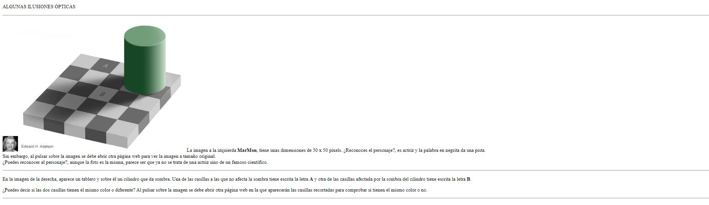
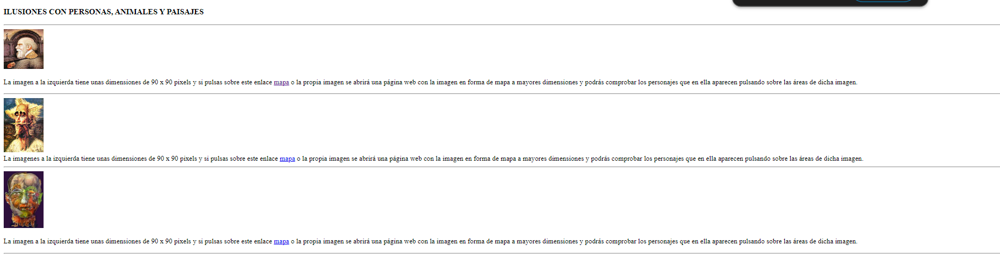

/Segundo%20trimestre/Ejercicios_Hoja_3/ejercicio_05/ejercicio_09XHTML.xhtml  )
/Segundo%20trimestre/Ejercicios_Hoja_3/ejercicio_05/ejercicio_10XHTML.xhtml  )

- Adapte los ejercicios nueve y diez de la primera hoja de trabajo de HTML a las especificaciones del estándar XHTML.

- Valide la correcta visualización de los documentos resultantes en los navegadores Internet Explorer, Mozilla Firefox y aquellos instalados en la práctica anterior.

- Documente los resultados obtenidos, prestando especial atención a las posibles incompatibilidades o particularidades observadas en cada navegador
