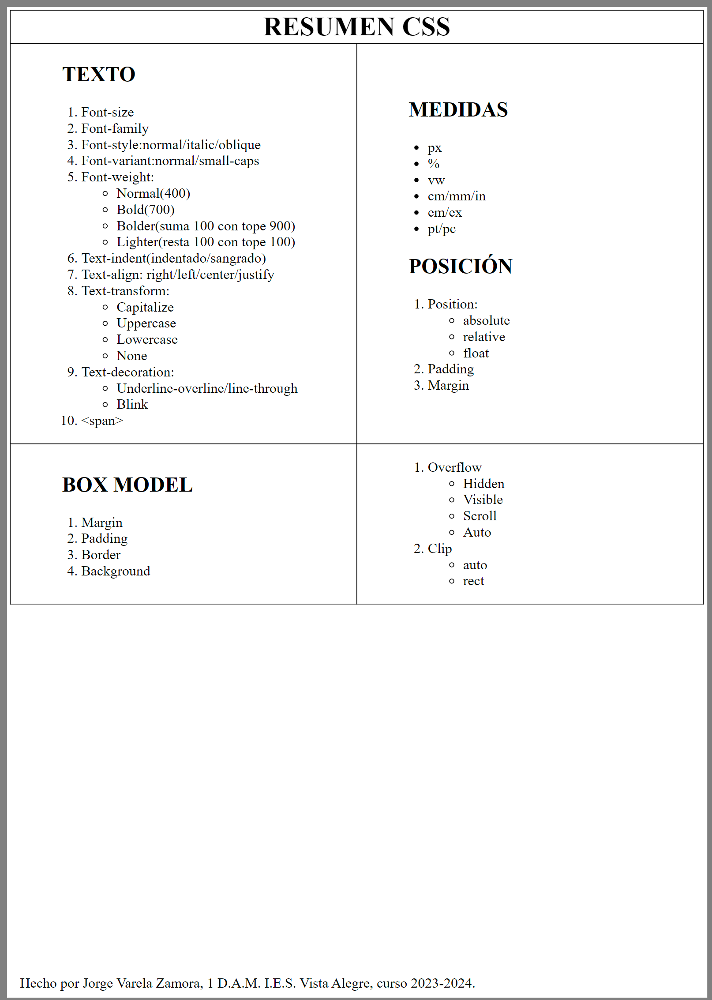

### Este ejercicio consistía en hacer un resúmen de las propiedades deCSS del temario. Elegí hacerlo en formato web (xhtml), con la medida exacta de un folio.

## Haz click en la foto para acceder a la web!

/Segundo%20trimestre/Ejercicios_Hoja_4/ejercicio8/ejericicio8.xhtml)
