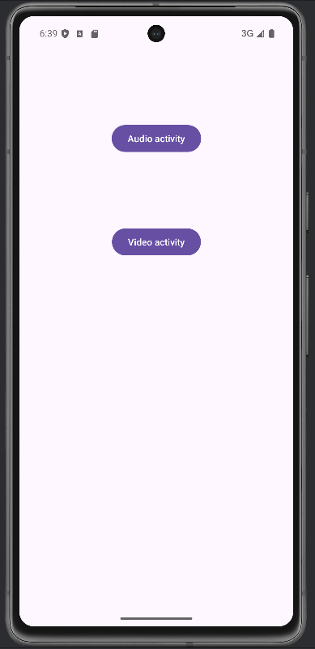
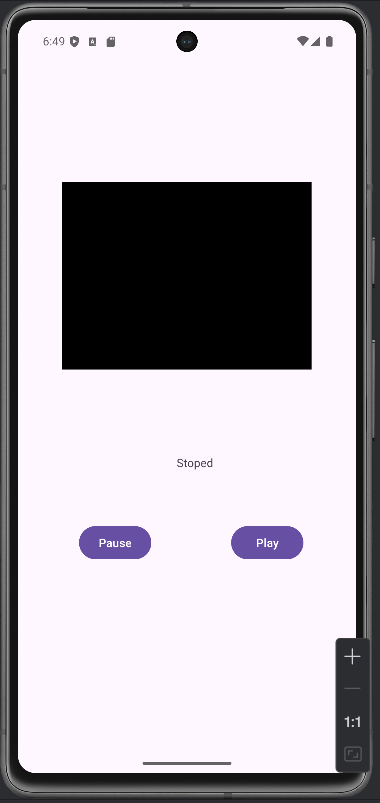
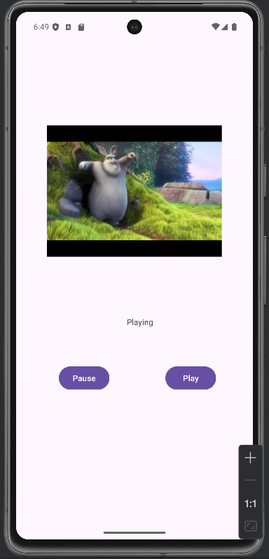
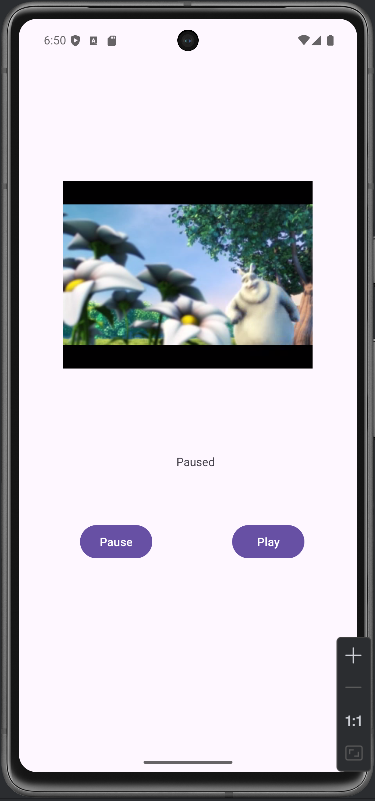
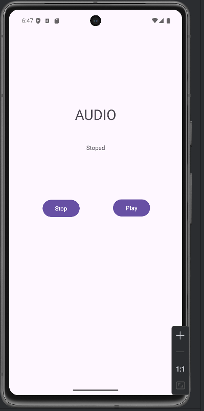
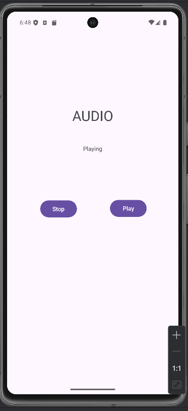
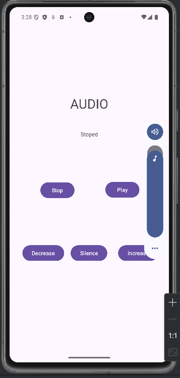
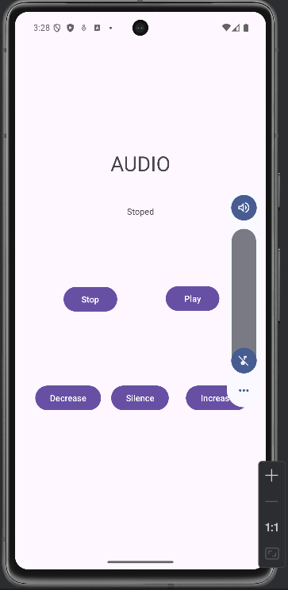

# MediaPlayer and VideoView

The goal of this exercise is to create an Android app with a menu that can play and pause both a video and an audio file. The audio control was an extra feature.
Made with ```Kotlin```.

|Photos from the app ||
| --------------------------------------------- | --------------------------------------------- |
|           |     |
|   |     |
|   |   |
|||
