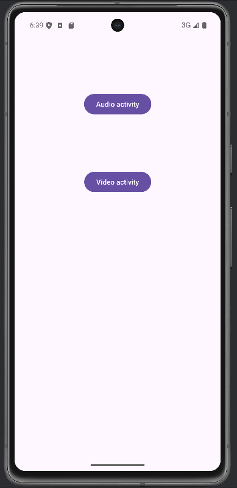
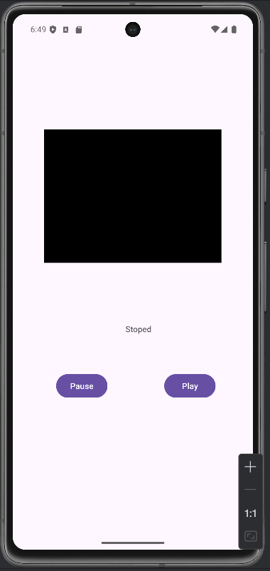
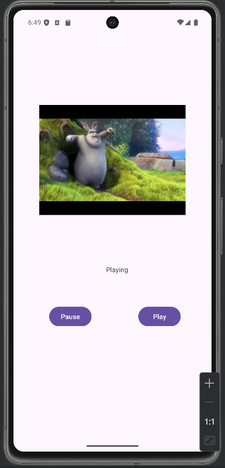
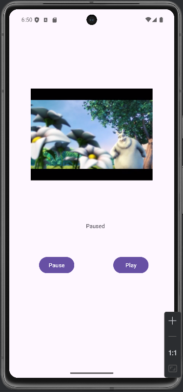
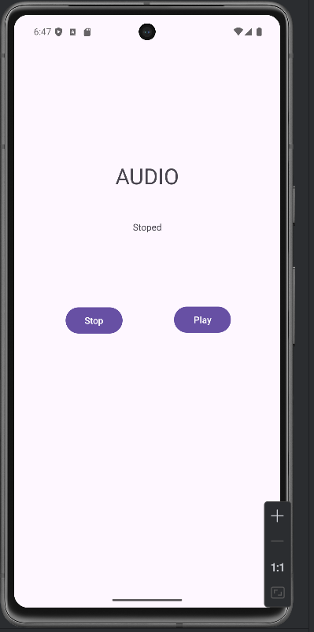
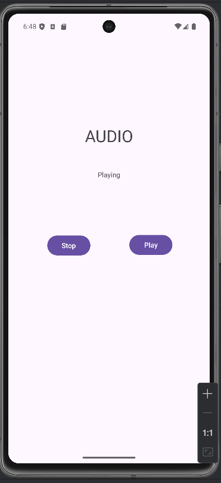
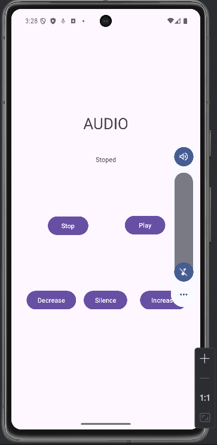
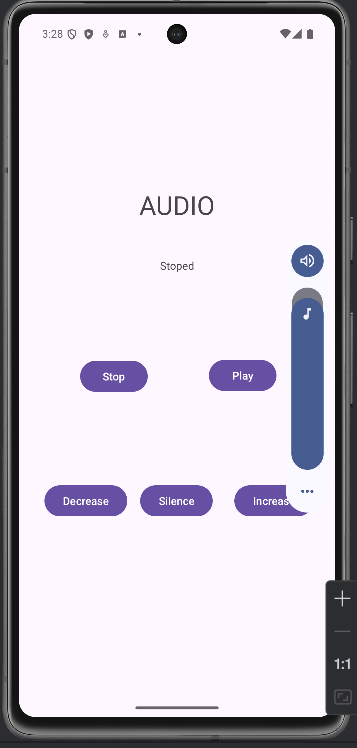

# Objetivo: 
Crear una aplicación con un menú que permita al usuario reproducir un archivo de audio y un archivo 
de video utilizando ```MediaPlayer``` y ```VideoView``` respectivamente.

---

He separado las actividades en dos. 
Al iniciar la del video, carga el Uri, y mediante un TextView informa de que está parado: 

|  |  |
|--|--|


Al iniciarlo, se inicia el vídeo y se cambia el TextView. Se puede volver a pausar: 

|  |  |
|--|--|


Y para el audio:

|  |  |
|--|--|


## Adicional:
 - Uso de ```AudioManager``` para subir, bajar y mutear el volumen:

|  |  |
|--|--|