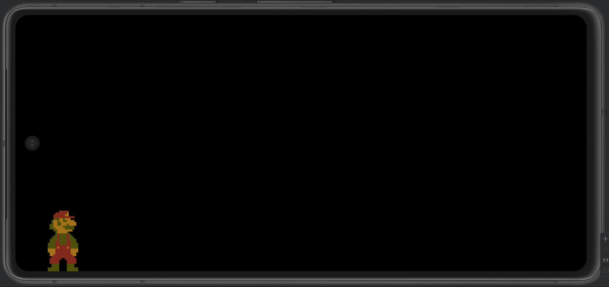
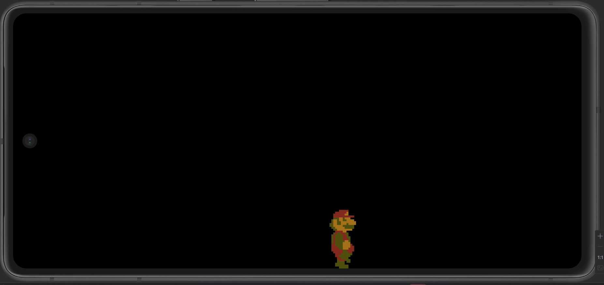
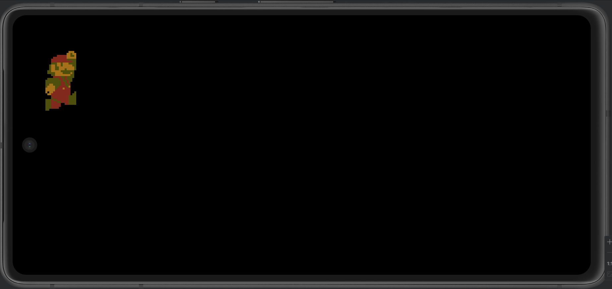
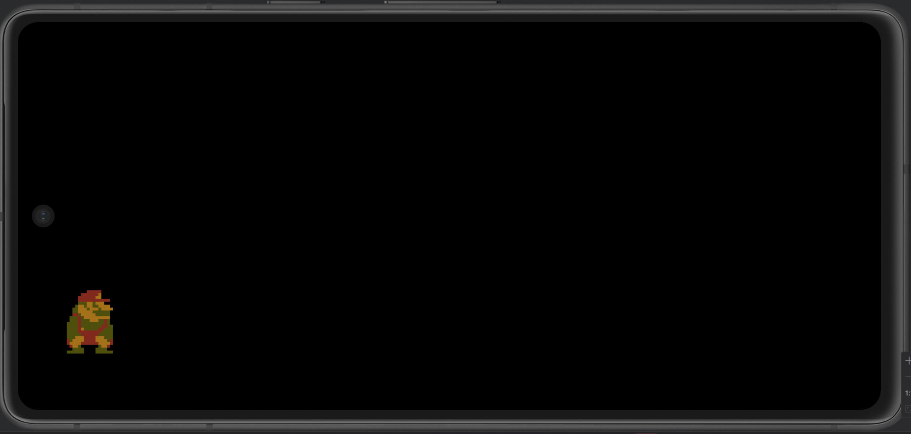
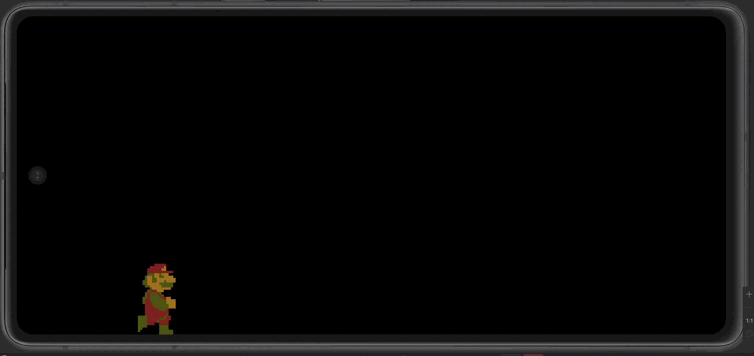

# Creacion de juego android con LibGdx

## Movimiento jugador

Uso ```Animation```, ```AtlasRegion``` y ```TextureRegion``` para crear animaciones diferentes. 

Sin dar a ningún botón: 


Hacia la derecha: 


Hacia arriba: 


Hacia abajo: 


Captura de vídeo con la app en ejecución: 



