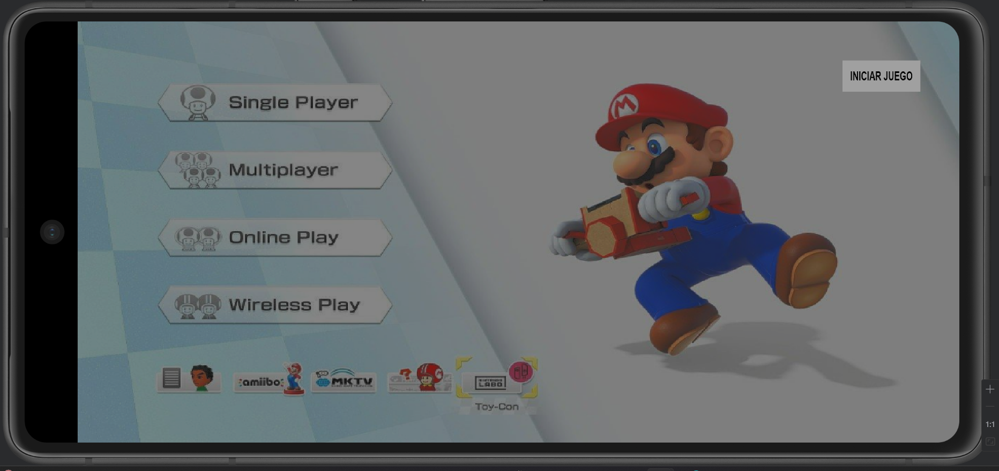
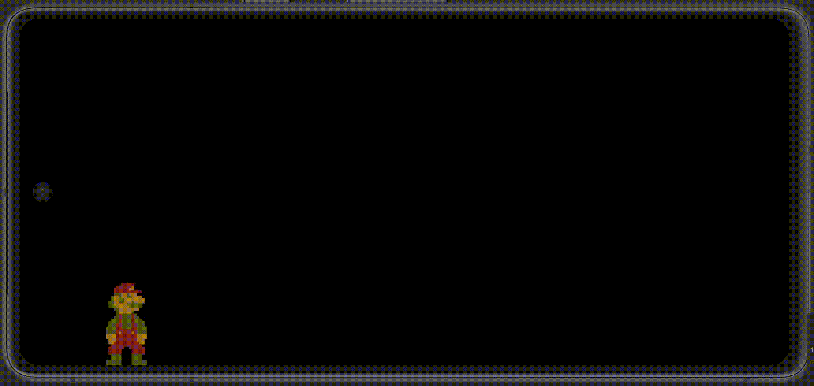

# Creacion de juego android con LibGdx

## Menú y Salto con gravedad 

Inicia el juego con un botón arriba a la derecha, **INICIAR JUEGO**: 

Gif con salto y gravedad:

## Adicional: Fondo de juego y enemigos

