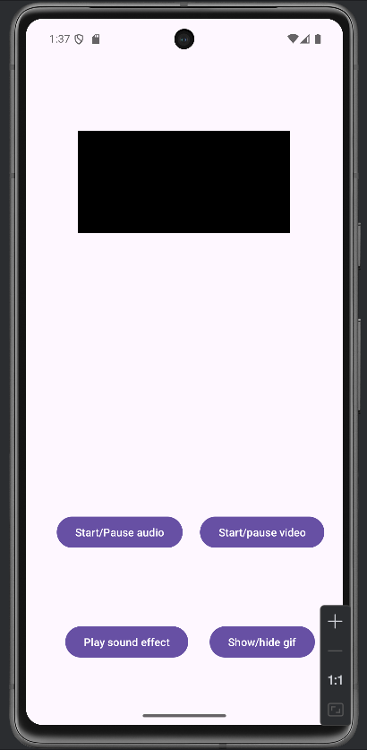
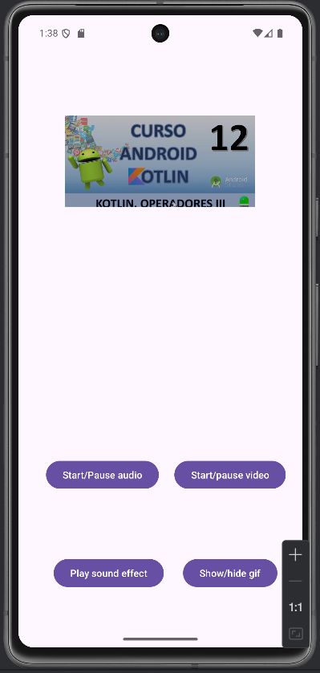
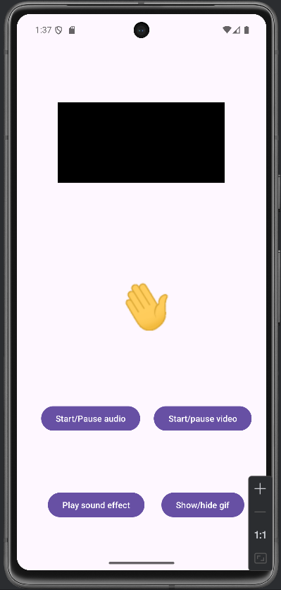

Actividad vacía con cuatro botones, VideoView e ImageView: 

|  |  |
|--|--|


En sound effect reproduce un sonido de un segundo, estilo notificacion, usando ```SoundPool```.
El Start/pause audio trabaja con ```MediaPlayer```, y todos los archivos usados estan en res/raw, excepto el 
gif, que esta en ```res/drawable```. 

|  |  |
|--|--|


Para dibujar el gif he tenido que usar la libreria [Glide](https://github.com/bumptech/glide), ya que el ImageView no soporta el formato Gif 
directamente, sino que hay que convertirlo antes.