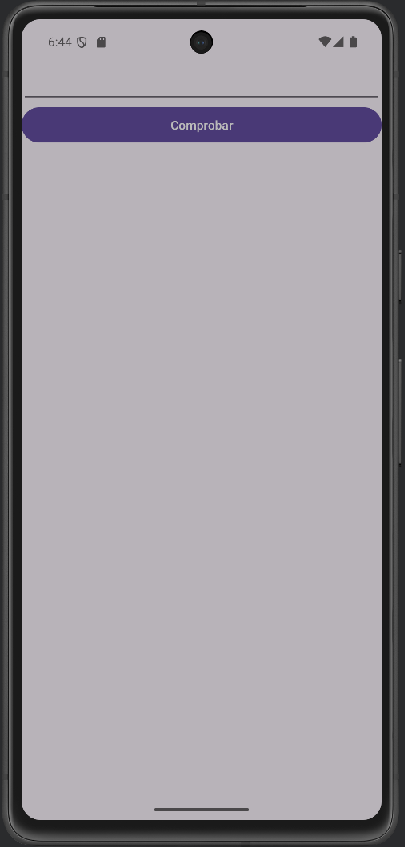
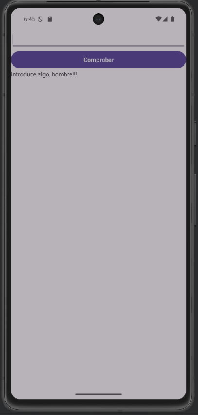
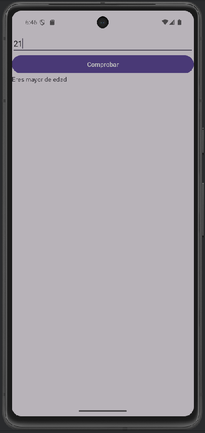
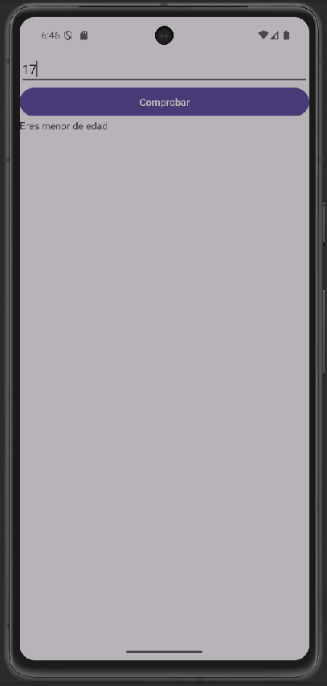

[Video 11 de Pildoras Informaticas](https://youtu.be/_OA_VdWLnCQ?si=NGLInLVPfSl4u6Kt)

# Operadores II

```Kotlin
val et1: EditText =findViewById(R.id.et1)

val btn1: Button =findViewById(R.id.btn1)

val tv1: TextView =findViewById(R.id.tv1)

btn1.setOnClickListener {
    val numero=et1.text.toString().toIntOrNull()

    /*if(numero==null) tv1.text="Introduce algo, hombre!"
    else if(numero<18) tv1.text="Eres menor de edad"

    else if(numero>18) tv1.text="Eres mayor de edad"

    else tv1.text="Tienes justo 18 años"*/

    tv1.text=if(numero==null) "Introduce algo, hombre!!!"

    else if(numero<18) "Eres menor de edad"

    else if(numero>18) "Eres mayor de edad"

     else "Tienes justo 18 años"
}
```

Pildoras Informaticas nos enseña a hacer codigo DRY (Don't repeat yourself), ahorrando código, con las lineas de después del comentario.

|   Imagenes del proyecto              |                                      |
|--------------------------------------|--------------------------------------|
|   |  |
|||