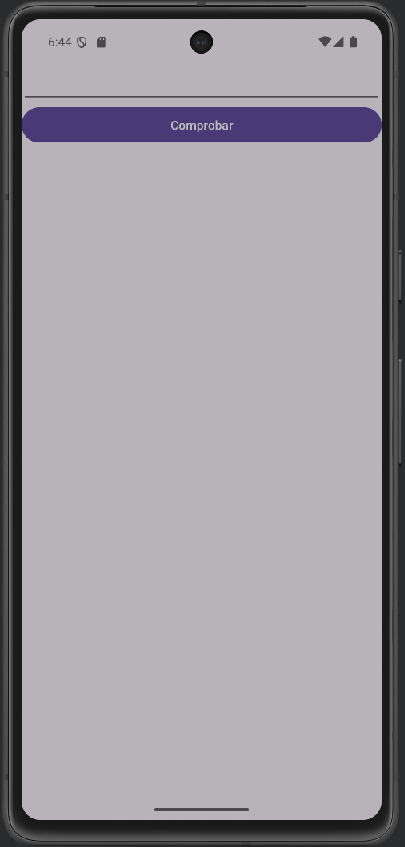
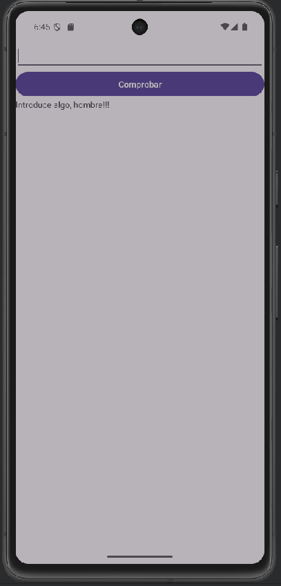
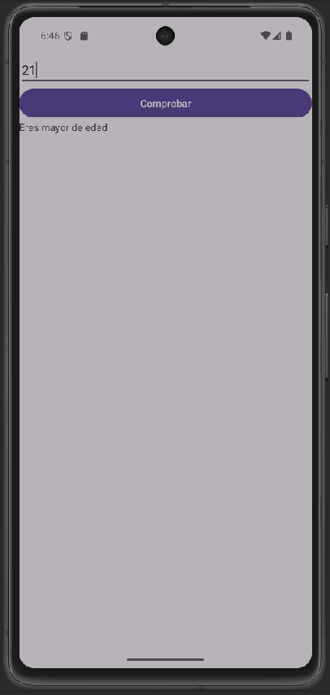
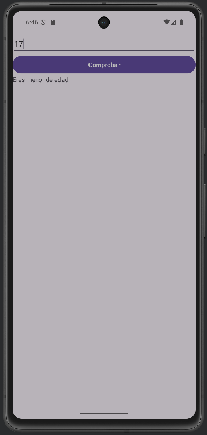
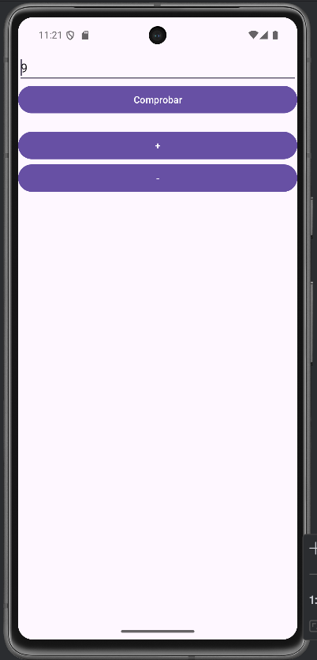

[Video 11 de Pildoras Informaticas](https://youtu.be/_OA_VdWLnCQ?si=NGLInLVPfSl4u6Kt) ,
[Video 12 de Pildoras Informaticas](https://youtu.be/0gx7pLus1dg?si=HR4WYirAPCYNaePc)

# Operadores II, III


## Video 11
```Kotlin
val et1: EditText =findViewById(R.id.et1)

val btn1: Button =findViewById(R.id.btn1)

val tv1: TextView =findViewById(R.id.tv1)

btn1.setOnClickListener {
    val numero=et1.text.toString().toIntOrNull()

    /*if(numero==null) tv1.text="Introduce algo, hombre!"
    else if(numero<18) tv1.text="Eres menor de edad"

    else if(numero>18) tv1.text="Eres mayor de edad"

    else tv1.text="Tienes justo 18 años"*/

    tv1.text=if(numero==null) "Introduce algo, hombre!!!"

    else if(numero<18) "Eres menor de edad"

    else if(numero>18) "Eres mayor de edad"

     else "Tienes justo 18 años"
}
```
Pildoras Informaticas nos enseña a hacer codigo DRY (Don't repeat yourself), ahorrando código, con las lineas de después del comentario.

## Video 12

```++numero``` hace **preincremento** , es decir, cuando se usa devuelve las funciones despues de incrementar.

Si escribes numero++, devuelve y despues incrementa

```Kotlin
fun main() {

    var numero:Int = 5

    println(numero++) // 5
    println(numero)  //6

    var numero2:String = 1

    println(++numero) //2
    println(numero)   //2
}
```

| Imagenes del proyecto                  ||
| -------------------------------------- | :------------------------------------- |
|     |    |
|  |  |
|       |   <- Video 12                          |